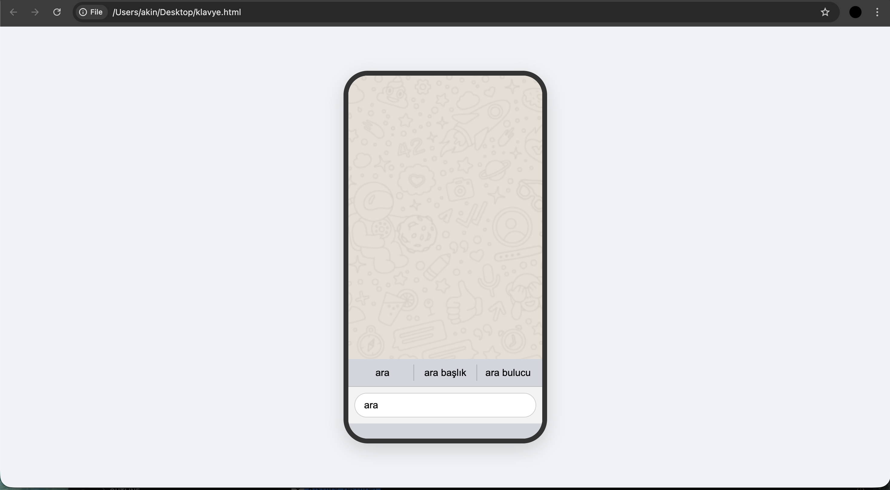

# SmartSpeller 

SmartSpeller, **Java** kullanılarak geliştirilmiş, merkezinde **Trie (Önek Ağacı)** veri yapısı bulunan yüksek performanslı bir otomatik kelime tamamlama (autocomplete) ve arama motoru projesidir. 

Sistem, 50.000 kelimelik geniş bir sözlük veri setini bellekte (in-memory) optimize edilmiş bir şekilde tutarak, kullanıcı web arayüzünde harfleri girdiği anda milisaniyeler içinde öneriler sunar.

##  Öne Çıkan Özellikler

*   **Işık Hızında Arama (O(L) Karmaşıklığı):** Geleneksel kelime arama algoritmaları yerine Trie veri yapısı kullanılarak, arama süresi kelime uzunluğuna (L) indirgenmiştir.
*   **Geniş Veri Seti:** 50.000 kelimelik sözlük kapasitesiyle günlük kullanım senaryolarına tam uyum sağlar.
*   **Full-Stack Mimari:** Arka planda güçlü bir Java backend çalışırken, ön tarafta modern ve hızlı yanıt veren web tabanlı bir arayüz (Frontend) bulunur.
*   **Dinamik Öneriler:** Kullanıcı klavyeden her harf tuşladığında sistem anlık olarak güncellenir ve en uygun kelime havuzunu daraltarak listeler.

##  Kullanılan Teknolojiler ve Veri Yapıları

*   **Backend:** Java
*   **Frontend:** HTML / CSS / JavaScript
*   **Temel Veri Yapısı:** Trie (Prefix Tree)
*   **Geliştirme Ortamı (IDE):** IntelliJ IDEA

##  Neden Trie Kullanıldı?

Projenin kalbi Trie veri yapısıdır. Standart bir `List` veya `Array` içinde 50.000 kelimeyi tek tek dolaşmak büyük bir performans kaybına (O(N)) yol açar. Trie yapısı sayesinde ortak önekleri (prefix) paylaşan kelimeler aynı düğümlerde (node) tutulur. 

Örneğin, "bilgisayar" ve "bilgi" kelimeleri bellekte "b-i-l-g-i" yolunu ortak kullanır. Bu mimari, bellek tüketimini optimize ederken arama hızını muazzam ölçüde artırır.

##  Kurulum ve Çalıştırma

Projeyi kendi bilgisayarınızda (lokalinizde) çalıştırmak için aşağıdaki adımları izleyebilirsiniz:

1. **Repoyu Klonlayın:**
   ```bash
   git clone [https://github.com/akin2420/SmartSpeller.git](https://github.com/akin2420/SmartSpeller.git)
   Projeyi Açın:
   
2. Klonladığınız klasörü IntelliJ IDEA üzerinden açın.

3. Sözlük Dosyasını Kontrol Edin:
dictionary.txt (50.000 kelimelik veri seti) dosyasının doğru dizinde olduğundan emin olun.

4. Çalıştırın:
Ana Java sınıfını derleyip çalıştırarak yerel sunucuyu ayağa kaldırın ve tarayıcınızdan localhost üzerinden web arayüzüne erişin.


